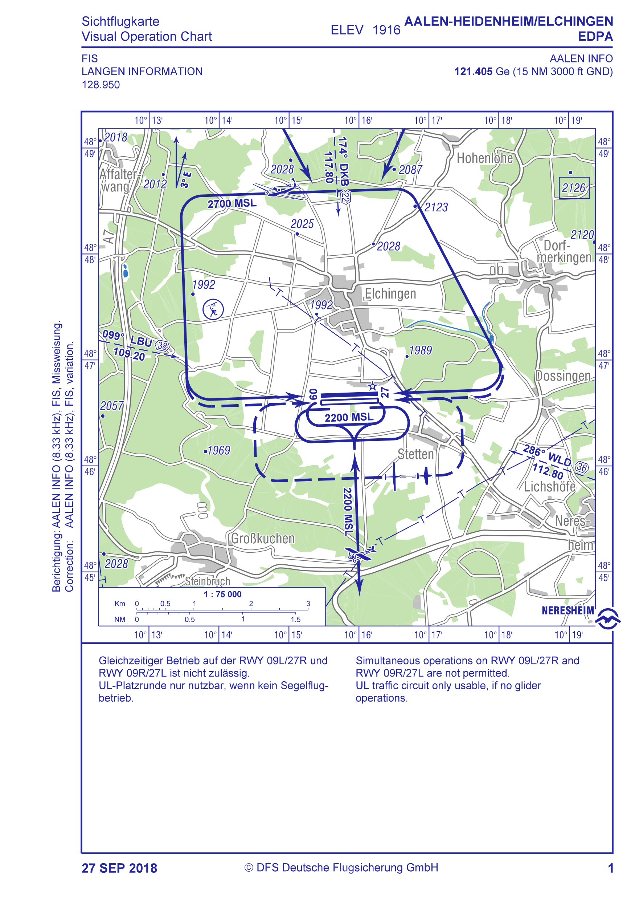

This is just a little demo to compare a few image difference computation methods with each other.

Just run the test in [ParallelDiffHandlerTest.kt](composeApp/src/jvmTest/kotlin/de/mpmediasoft/imagediff/ParallelDiffHandlerTest.kt)

The test computes the difference between two images in a red channel of the result image.

The old image

[](VP00150-old.png)

and the new image

[](VP00150-new.png)

are modified versions of the same base image. The content of the old and new image have an offset of -7/7 pixels and some elements inside the image have changed. The diff is computed in order to see what has actually changed inside the image while ignoring the offset.

[](VP00150-computed-diff.png)

Three different algorithms are used:

1. _sequentialDiffOfRawArgbIntImageData
2. _simpleParallelDiffOfRawArgbIntImageData
3. _chunkedParallelDiffOfRawArgbIntImageData

I obtained the following results:

````{verbatim}
//                           mac-mini X86                    mac-mini AARCH64
// Single-threaded         : Diff computed in 36.511684ms    13.940397ms
// Multi-threaded (simple) : Diff computed in 12.681792ms    5.277718ms
// Multi-threaded (chunks) : Diff computed in 10.516840ms    3.349768ms
````
